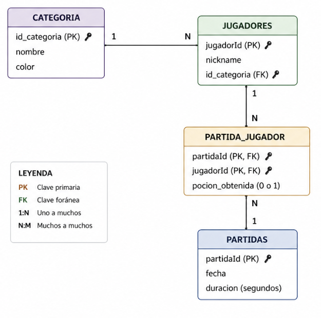
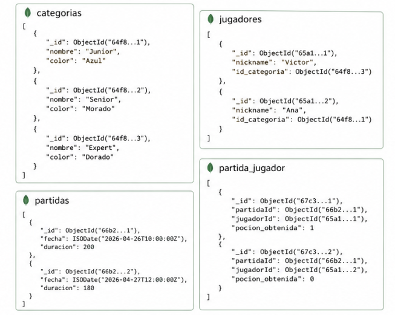

## Funcionalitat implementada i millores fetes (MOTXILLA):
- Implementació i gestió de les col·lisions:
    1. Entre jugadors.
    2. Entre jugadors i objectes.
- Gestió de l'assignació de personatges a través del server.
- Millora en la llista de jugadors en partida (evitant noms que es quedaven encara que haguessin sortit de la partida).
- Actualització de la visualització del mapa i dels objectes.
- Major especificació a l'anàlisi d'ERP.

## Tablas MySQL - Navision Dynamics

## Colecciones MongoDB

